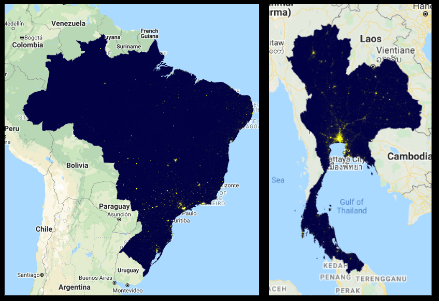
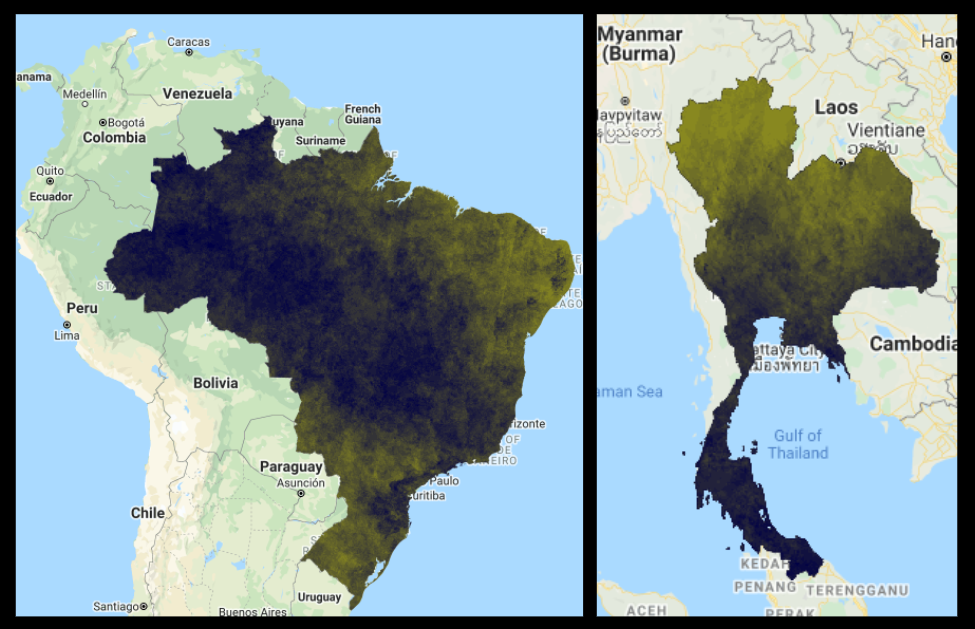
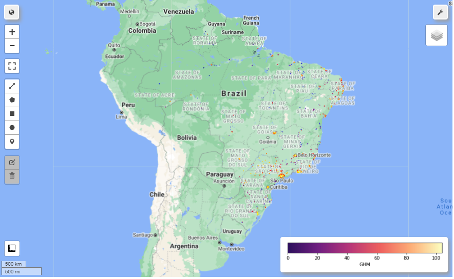
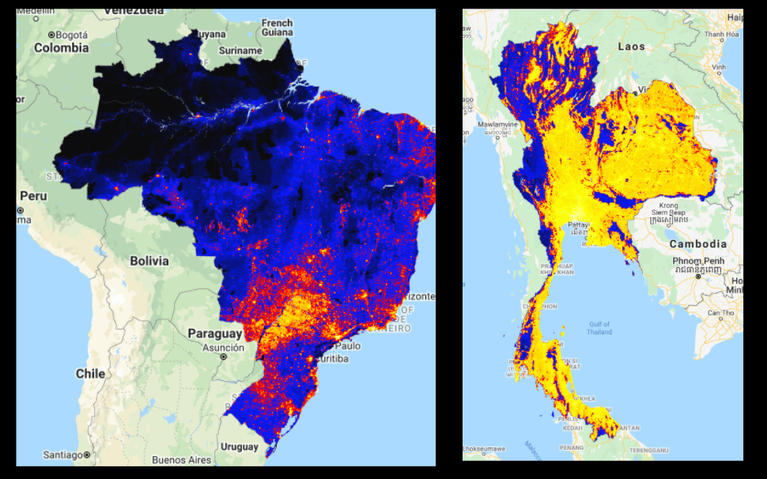
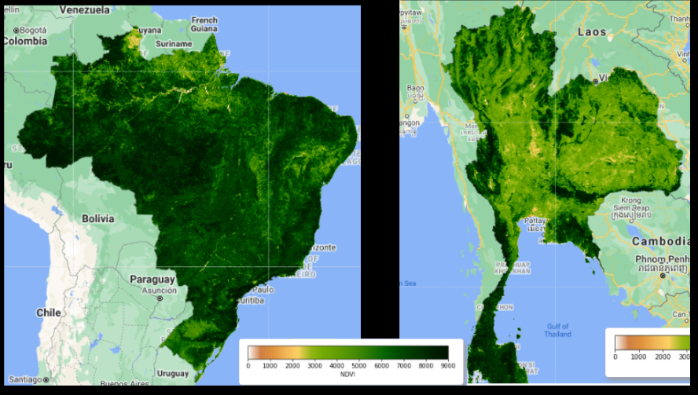
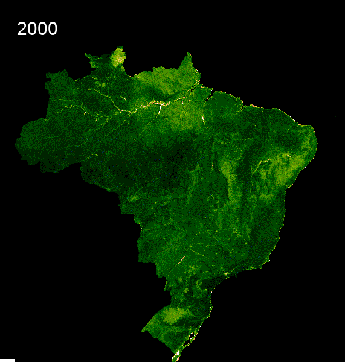

# Exploratory Data Analysis

As a disclaimer, some of this EDA is to explore our raw data and what it looks like. However, to run these notebooks, especially with using the satellite data and school points you will already need to run the Data Gathering and Feature Engineering Scripts first.

## Satellite Data
The first thing we wanted to explore in our Exploratory Data Analysis was some maps of what our countries looked like and how our predictors might map onto our countries. We used Google Earth Engine to create some maps of nighttime imagery, the global human modification index and the vegetation index. For nighttime and vegetation index, we also wanted to show the change in time as we were using the rate of change as a predictor as well. Below you will find some static images of the maps we created. If you click on them, you can also find an interactive version. [Click here](scripts/Satellite_Data_EDA.ipynb) to see the Jupyter notebook with code included for replicating the maps below. 

Satellite Images on a National Level for both Brazil and Thailand:

1. Average Radiance Band   
    Here we see that the Average light comes from the big cities in the south for both countries. This predictor later plays a big role in determining internet connectivity. [Click on this map](Images/avg_rad_layers.html) to see a comparison between school points and the entire country average radiance in 2014 and in 2019.   
    

2. Cloud Free Band   
    This is a second band within the VIIRS Satellite nighttime images. It measures light without clouds or solar illumination. In some ways, specifically in tropical rainforests which both Brazil and Thailand have, it is a better measure of light emittance than the average radiance band. We use both as predictors in our model. Additionally, you see in the maps that the light emittance looks vastly different.  [Click on this map](Images/cf_cvg_layers.html) to see a comparison between school points and the entire country cloud free coverage in 2014 and in 2019.   
    

3. [Global Human Modification Map](Images/ghm_map.html)

    In this map, we see the level of Global Human Modification in the last few years within both Brazil and Thailand. For more information on how this dataset was compiled, please see the Data Gathering page. Click on this [Brazil Map](Images/ghm_map.html) to see the country level data.   
    

    

4. Normalized Difference Vegetation Index   
    Here we see the difference in vegetation between Brazil and Thailand. [Click here](Images/NDVI_Brazil.html) to see the map for Brazil, toggle between the layers to see the entire country and just the school point areas.   
    

6. Here we also see GIFs that show the time series change of vegetation from 2000 to 2021. 

    

    

## Speedtest data

## Open Cell ID data

## Facebook Data

## Training Set EDA
We also did some Exploratory Data Analysis once our training dataset was created. You will not be able to run this on your own until you have run the Data Gathering and Feature Engineering scripts. [Click Here](scripts/testing.html) for the full notebook of explanatory visualizations. [Click here](scripts/testing.ipynb) for the Jupyter Notebook .ipynb file. 
