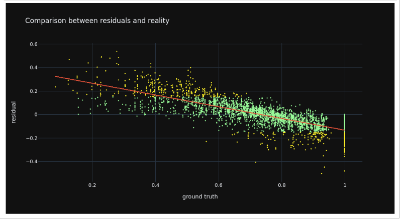

# Modeling Section:

The model we needed to train was a regression model that predicts the average share of households' internet connectivity in an enumeration area on a scale from 0 to 1. A  prediction of 0 means that of the households surveyed, no households in the enumeration area stated that they had access to internet, whereas a prediction of 1 means that every household surveyed in the enumeration area had access to internet. In the Brazilian survey data, the average responding households per enumeration area were around 11. Logically, most of the responses fell between 0 and 1, indicating that some but not all families had internet access. Later on, we experimented with transforming the approach into a classification problem, however it did not increase model accuracy.

## Training Set EDA
Once we created the training dataset was (for more information, see data gathering), we performed some Exploratory Data Analysis on it. [Click Here](scripts/testing.html) for the full notebook of explanatory visualizations. [Click here](scripts/testing.ipynb) for the Jupyter Notebook .ipynb file. 

## Mlflow Set-up (Optional)

In order to track our models, we set up autologging in mlflow. [Mlflow](https://www.mlflow.org/docs/latest/index.html) is an exciting tool for logging machine learning models, their respective KPIs and additional information. We set up our model training so that the python scripts create a new experiment for each run that logs each of the model parameters when we did hyperparameter tuning and then logs the best parameter at the top. In this way, we were able to compare the various parameters logged in each run to determine how to change the grid space of the hyperparameters. We also were then able to compare the different models to each other. Additionaly, we logged the predictors, requirements for packages and dependencies for each run. Every run's winning model was logged as an artifact, so one can easily reload the model and apply it to other data. In order to make our following analyses as reproducible as possible, we are providing a few of our winning models from different model classes. Below you can see a screenshot of mlflow which logs the best runs, with the best hyperparameters and a custom metric for evaluation.  On the side, you can also see the list of other experiments we ran with different model classes. 
    

        ``` #### mlflow setup ####

        # save runs
        mlflow.set_tracking_uri("file:///files/mlruns")
        mlflow.tracking.get_tracking_uri()

        #Naming the set_experiment
        dt = date.today().strftime('%d/%m/%Y')
        experiment_name = dt + model_config['meta']['experiment_name']
        mlflow.set_experiment(experiment_name)
        mlflow_client = mlflow.tracking.MlflowClient()
        experiment_id = mlflow_client.get_experiment_by_name(experiment_name).experiment_id ```

Here you can see the simplicity of reloading the model artifact later on and applying it to new data:
    


## Model Configuration
Once we have mlflow and the respective model_config.yaml file set up, we can run many different experiments using our .py scripts by simply changing a some things within the configuration yaml file. [Click here](scripts/model_config.yaml) to see the full yaml file. Below you can also see how it was set up. We use this to steer our scripts and set our parameters. We set up the input data at the top which is the training data, then label the target and predictor variables as well as the name of the experiment and a brief description in run_name. Under the parameters section, we set parameters like test size (which is crucial), the amount of cross validation folds to do, the number of iterations and the threshold for our custom metric. The threshold tells the model which percent of schools with low internet connectivity to focus on. Then within parameters, there are different sections based on what type of model you might decide to run. Our .yaml file contains parameters for grid search within Random Forest, LightGBM and XGBoost. In our current scripts, we've commented out the mlflow logging for hyperparameter tuning. 


## Model Training

We tried our 7 different model classes and ran more than 100 experiments each containing 20 runs at minimum that tried various parameters in order to determine which model had the best accuracy. We experimented with  different combinations of parameters and predictors. Below is the final list of predictors we used and a heat map displaying their collinearity. As you can see, we do not find high multi-collinearity among our predictors except with the mean global human modification and the mean average radiance. However, both predictors showed high feature importances and were therefore kept in the model. 
    

In this figure, one can see the correlation between predictors and our target variable. Predictors like the global human modification and average radiance showed the largest positive correlations. 


Another way to improve accuracy was by building a custom metric in order to score both our test set within our cross validation and our final holdout set. The metric calculates errors specifically by taking all predictions below .3 (or another threshold, we also experimented with .5) subtracting that from the ground truth below .3 (or another threshold), taking the absolute value and then returning the average of all those errors. Below please find a code snippet of our custom metric.

        #Create custom scoring
            def custom_eval_metric(y_true, y_pred):
            errors_low = abs(y_pred[y_pred<0.3] - np.asarray(y_true[y_pred<0.3]).flatten())
            return np.mean(errors_low)

        custom_scorer = make_scorer(custom_eval_metric, greater_is_better = False)

        # define grid search
        search = GridSearchCV(model, parameters, scoring = custom_scorer, cv = inner_cv ,
                                    refit=True,
                                    verbose = 2)

 We built the metric as we wanted to put the focus on having better accuracy on schools with lower internet connectivity. Before instituting the custom metric, our models performed well with predicting the medium values, but they had much larger errors at either end of the spectrum and particularly on the low values. In order to remedy this issue, we first dropped any rows that had an internet connectivity of zero (there were 23 of them). We dropped the zeros because they were most likely occuring due to incomplete data rather than enumeration areas truly having no households connected. Furthermore, as a value of 0 only occured for 23 observations, it did not severely impact the data class balancing. Secondly, we instituted our custom metric which trained the model to minimize the error score under the .3 level of prediction. 

 Within our scripts, we offer two ways of doing cross validation. One is by grid search which searches through every combination of the hyperparameter grid space to find the best combination. The other format is Randomized Grid Search which searches through a random combination and is steered by the number of iterations (or combinations to test out) given to it in the config file. As we have tested all the hyperparameters, the current grid space is much smaller than prior and we have chosen to include gridsearch cv with randomized cv commented out in case further research wants to add more parameters and repeat the tuning. 
 
 The resulting champion out of over 2000 models was an XGBoost model with an average error of .06. Specifically for under the .3 threshold, the model had an average error of .05. This means that the overall and low-threshold accuracy appears to be on an adequate level, as on average the predictions are off by just 5 percentage points from the ground truth value. 

 Below, you can see the list of all model classes we tried. Feel free to try out running these models yourselves or reading the code by clicking on the hyperlinked script. There is further documentation within each script on how it runs, and how it works with mlflow logging.

1. Linear Regression
    - [Python script with Mlflow](scripts/train_Linear_Regression.py)
2. Random Forest 
    - [HTML File](scripts/Training_Random_Forest.html)
    - [Jupyter Notebook](scripts/Training_Random_Forest.ipynb)
    - [Python Script with Mlflow](scripts/train_Random_Forest_no_mlflow2.py) 
    - [Python script without Mlflow](scripts/train_Random_Forest_clean.py)
2. XGBoost 
    - [HTML File](scripts/training_XGBoost.html)
    - [Jupyter Notebook](scripts/training_XGBoost.ipynb) #this is not correct
    - [Python Script with Mlflow](scripts/train_XGBoost_no_mlflow.py) 
    - [Python script without Mlflow](scripts/train_XGBoost_Exp1.py)
3. LightGBM 
    - [HTML File](scripts/Training_Light_GBM.html)
    - [Jupyter Notebook](scripts/Training_Light_GBM.ipynb)
    - [Python Script with Mlflow](scripts/lightgbm_mlflow_train.py)
5. SVM
    - [Python Script with Mlflow](scripts/svm_mlflow_train.py)
6. Neural Net
    - [Python Script with Mlflow](scripts/nn_mlflow_train.py)
7. Random Forest Classifier 
    - [HTML File](scripts/training_RF_classifier.html)
    - [Jupyter Notebook](scripts/Training_Random_Forest_Classifier_v2.ipynb)


## Model Evaluation and Results 

Below we see a comparison of the average low connectivity errors of all models. Clearly the Random Forest and XG Boost model were most accurate in predicting the low connectivity school areas.
[Click on this link](scripts/Model_Comparisons_keep.ipynb) to see a notebook with the model comparisons. [Click here](scripts/Model_Comparisons_keep.html) for the HTML version. 


The winning XGboost model produced an error of .06 and a low average error of .05 with the hyper parameters of: eta: .2, max_depth: 9 and n_estimators: 550. 

Click on this link for the notebook with the [Random Forest Predictions](scripts/Thailand Predictions_ XGBoost_Model.html) and click on this link for the notebook with the [XGBoost Predictions](scripts/Thailand Predictions_ XGBoost_Model.html).

Here is a map of our predictions for schools within Brazil. Figure 1 displays the location for all the schools where the ground truth is less than 30% connected to the internet. There are 69 schools in Brazil survey data that have less than 30% internet connectivity. Figure 2 shows schools where our Random Forest model prediction was actually less than 30% connected to the internet. While we can see that not all schools below 30% were predicted correctly below the threshold, the low error score indicates that if the model succeeds below-threshold prediction, it performs well. While the Random Forest model predicted 14 schools under 30%, the XGBoost predicted 29. 

Figure 3 shows the predictions for all schools in the test set mapped out. This gives us an understanding of where the higher and lower connected school areas are located regionally. It appears that the higher connected schools areas are on the coast (the yellows and light greens) while the lower connected schools are located more inland. In Figure 4, we see the errors mapped out for the schools in the test set. For most schools the error scores appear to be on a low level, however large error predictions should be further examined, especially if they occur systematically at schools with low average connectivity.


This graph compares predictions to reality in a scatter plot. We can see that the points are mostly close to the line except within the lower range of connectivity. 


Then we examine the residuals compared to reality. Most residuals hug tightly to the line except for some observations at the very low and high end.



Lastly, we also see the comparison of distributions between reality and predictions. While the predictions curve is significantly steeper, the overall curves generally follow each other and have a similar center.


## Model Interpretation
As part of our winning models, we wanted to see which predictors had high feature importances within the model. Below, is the graph for both the winning Random Forest and XGBoost model feature importances. For both models, the average radiance seems to have significant predictive power, however the importances of other features differ largely between RF and XGBoost. While average download speed has a large feature importance value for XGBoost, it was one of the least important features in the RF model. Moreover, Vegetation Index and Facebook users are key features in the RF model but only played a marginal role in XGBoost.


!! wrong variable names and potentially wrong graphicc


Subsequently, we further investigated the effects of features on the prediction by examining the shapley values. The graphic below shows the scattered effects that predictors had on one specific prediction for the champion XGBoost model. In addition, it indicates how relatively high or low values of features impacted the overall prediction.


While low impact features like average download and upload speed look normally distributed around zero, important features like Facebook can be interpreted more reasonably. For this model, low monthly Facebook users resulted in a (much) lower prediction of online population. Similarly, low values of average radiance yielded lower predictions. 

In order to examine impact of the features in detail, we looked at shapely values where the model performed particularly well and particularly poorly (i.e. very low and high errors). 
For errors larger than 0.4 most of the shapley values are scattered around 0, however from the image below we can not make out a clear pattern around why these predictions turned out to be poorly. 
Similarly, an inspection of shapely values where the errors were lower than 0.05 does not yield an obvious difference to the overall shapely values. Thus explaining the high performance of predictors for schools with error lower than 0.5. 


We evaluated how the feature importance changes across the range of feature values by creating line and scatter plots indicating the value und respective importance.  This example depicts the feature importances for the range of average radiance values. We can observe a clear pattern, that the more the radiance deviates from the mean either in a positive or negative direction, the stronger the respective effect on the prediction appears to be. Very low values have strong negative effects, whereas large values typically have a strong positive effect on the prediction. 


Ultimately, we spot-checked a single school area prediction with observing how the collection of features influenced this particular prediction. This again can be done for all school areas but also subsetted for a set of observations with very high or low errors. In the example below, we are examining a school area prediction with a high error. When inspecting this particular prediction, we observe that Facebook data did not have a significant impact. This might be one reason the error is so high.


